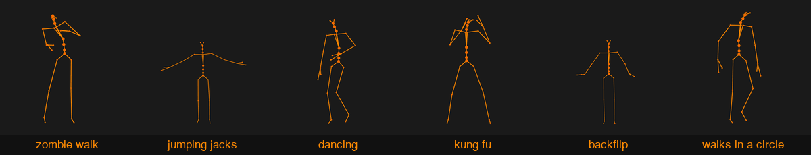
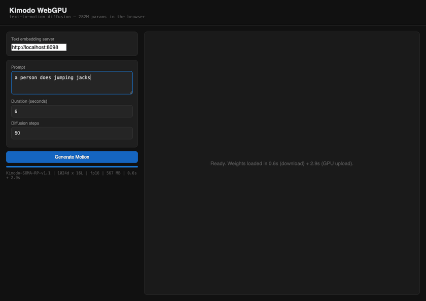

# Kimodo WebGPU

Run NVIDIA's [Kimodo](https://github.com/nv-tlabs/kimodo) text-to-motion diffusion model **in the browser** using WebGPU compute shaders.

Type a text prompt, get an animated skeleton. The 282M parameter diffusion transformer — all 200 forward passes per generation — runs on your GPU through WebGPU compute shaders. No CUDA, and no PyTorch in the diffusion loop.



*All six clips above were generated by this repository running in Chrome — one text prompt each, diffused on the browser GPU, decoded to a 30-joint skeleton by the in-page FK.*

**This is a hybrid route, and the split matters.** The browser owns diffusion, classifier-free guidance, DDIM sampling, forward kinematics, and rendering. Text encoding does *not* run in the browser: each generation makes one call to a local Llama 3 8B server for a 4096-float embedding. That server is an external prerequisite you must supply — see [Setup](#setup) before cloning expectations. Without it the app loads, reports the missing endpoint, and cannot generate.

## What it does

- **Text in → motion out.** "A person walks forward and waves" produces a 6-second, 30fps skeletal animation.
- **200 GPU compute passes per generation.** 50 DDIM diffusion steps × 2 sub-networks × 2 passes (classifier-free guidance) = 200 transformer forward passes, all running as WebGPU compute shader dispatches.
- **Client-side diffusion + FK.** The browser handles DDIM noise scheduling, diffusion denoising, TwostageDenoiser routing, classifier-free guidance, forward kinematics, and skeleton rendering. The one exception is text encoding: an external server provides a single 4096-float embedding per generation (Llama 3 8B). You must supply that server — it is not included here.
- **30-joint SOMA skeleton** with full bone connectivity, animated at 30fps.

## Numerical accuracy

The WebGPU forward pass matches the PyTorch/MPS reference to **fp16 quantization precision**:

```
dim0: pytorch=-0.003261  webgpu=-0.003281  Δ=0.000020
dim1: pytorch= 0.323303  webgpu= 0.323948  Δ=0.000645
dim2: pytorch=-0.000158  webgpu=-0.000176  Δ=0.000018
dim3: pytorch= 1.412977  webgpu= 1.413085  Δ=0.000108
dim4: pytorch= 0.001225  webgpu= 0.001772  Δ=0.000547
```

Max absolute error: **0.000645** across all output dimensions through 16 transformer layers. The error comes from fp16 weight quantization, not computation bugs. Verified with fixed-seed deterministic comparison (`node tools/numerical_comparison.mjs`).

## Performance

On M4 Max (Chrome, WebGPU via Metal), 100 DDIM steps, measured 2026-09-15 with a headless witness driving this page:

| Clip | DDIM sampling | Note |
|------|---------------|------|
| 6 s (180 frames) | ~33 s | ~61 s before bounded submission landed (1.85× faster) |
| 18 s (540 frames, the UI maximum) | ~152 s | sequence length 592 tokens; attention cost grows quadratically with clip length |

Text embedding is ~0.3–0.8 s on the server; FK decode is 2–20 ms of JS. Sampling time scales linearly with the step count, so the UI default of 50 steps is about half the figures above.

The diffusion loop keeps at most two transformer passes in flight on the GPU queue — one command buffer per pass, about eight fences per step instead of one per kernel — and reuses one fixed scratch set across layers, so the per-step host/GPU round trips that dominated earlier builds are gone. For reference, the same model on PyTorch MPS takes ~12 s for a 6-second clip at 50 steps.

## Architecture

```
Browser (this repo)                        Server (you supply)
┌─────────────────────────────────┐       ┌──────────────────┐
│  540 MB fp16 weights (cached)   │       │ Llama 3 8B       │
│  ↓                              │  ←──  │ text encoder     │
│  DDIM loop (50 steps, ≤2 GPU   │ 4096  │ POST /embed      │
│    passes in flight):           │ floats│ (one call/gen)   │
│    Root model (16-layer xfmr)   │       └──────────────────┘
│    globalRootToLocalRoot (JS)   │
│    Body model (16-layer xfmr)   │
│    CFG guidance (JS)            │
│    DDIM update (JS)             │
│  ↓                              │
│  FK decode (JS)                 │
│  ↓                              │
│  Skeleton renderer (Canvas 2D)  │
└─────────────────────────────────┘
```

Runtime plumbing comes from [`@kaminos/webgpu-inference-kit`](https://www.npmjs.com/package/@kaminos/webgpu-inference-kit) (pinned `^0.1.52`): the bounded submission queue that paces the diffusion loop, backend-identity capture and validation, and the Kimodo route definition/receipt factories that stamp every generation with a validated receipt. The kernels themselves stay local.

**WGSL compute shaders** (kernel layer shared with [moge-webgpu](https://github.com/lyonsno/moge-webgpu)):

| Shader | Purpose | Reused from MoGE? |
|--------|---------|-------------------|
| `linear.wgsl` | Matrix multiply + bias | Yes |
| `attention.wgsl` | Multi-head self-attention with optional key masking | Yes (extended) |
| `layernorm_vit.wgsl` | Layer normalization | Yes |
| `gelu.wgsl` | GELU activation (tanh overflow protected) | New |
| `silu.wgsl` | SiLU activation for timestep MLP | New |
| `qkv_split.wgsl` | Deinterleave fused QKV projection | New |
| `elementwise.wgsl` | Residual connections (add, scale-add) | New |

## Model details

| Property | Value |
|----------|-------|
| Model | NVIDIA Kimodo SOMA-RP-v1.1 |
| Parameters | 282M (two 16-layer TransformerEncoder sub-networks) |
| Architecture | Post-norm, 8 heads × 128 dim, GELU, 1024 hidden, 2048 FFN |
| Skeleton | SOMA30 (30 joints: hips, spine, head, arms, legs, hands, feet) |
| Output | Joint positions (3D), rotation matrices, root trajectory, foot contacts |
| Weights | 540 MB (fp16 flat binary, converted from safetensors) |
| Diffusion | DDIM, cosine beta schedule, 50–100 steps |
| Text conditioning | Classifier-free guidance (w=2.0), LLM2Vec text encoder |

## Setup

Two commands, on Apple Silicon macOS with Node and Python 3 installed:

```bash
./setup.sh        # one-shot: venv + deps, Kimodo checkout, weights (~540 MB + ~16 GB encoder on first run)
./run_local.sh    # starts the embedding server and the app, prints the URL; Ctrl-C stops both
```

`setup.sh` re-runs safely: package installs are re-executed (they no-op when
satisfied) and completion is verified against what the route actually needs —
including the pinned Kimodo revision it fetches. Every failure names its
phase. Generated state lives in four places:

| Surface | Reset with |
|---|---|
| `.setup/` (venv, Kimodo checkout, logs, manifest) | `rm -rf .setup` |
| `public/kimodo.bin` (converted weights) | `rm public/kimodo.bin` |
| `node_modules/` | `rm -rf node_modules` |
| Hugging Face cache (checkpoint + encoder, shared with other tools) | leave it, or `hf cache` tooling |

This exact path — network clone, fresh venv, pinned Kimodo fetch — was
exercised end-to-end (through the live smoke suite) before this section landed,
and the scripts' failure paths (foreign process on the port, children dying
after startup, interrupted setup phases) are covered by
`tests/test_local_scripts.py`, which runs in seconds with no model or network.



*Captured from a clean clone set up with the two commands above — prompt in, 50 diffusion steps on the browser GPU, skeleton out.*

<details>
<summary><b>Manual setup</b> (what the scripts do, step by step)</summary>

### 1. Convert weights

Conversion needs only numpy and safetensors — no torch.

```bash
pip install safetensors numpy

# Download Kimodo SOMA-RP-v1.1 from HuggingFace
# (requires: huggingface-cli download nvidia/Kimodo-SOMA-RP-v1.1)

python tools/convert_weights.py \
  --model /path/to/Kimodo-SOMA-RP-v1.1/model.safetensors \
  --output public/kimodo.bin \
  --dtype fp16
```

### 2. Provide a text embedding endpoint

The browser cannot compute one thing: the 4096-dimension text embedding from Kimodo's LLM2Vec/Llama 3 8B encoder. `tools/embed_server.py` serves exactly that and nothing else.

```bash
# Requires a Kimodo checkout (https://github.com/nv-tlabs/kimodo) and a Python
# environment with its dependencies — including PyTorch, which Kimodo expects to
# be installed already and does not declare. The server does NOT read the SOMA
# diffusion checkpoint; it loads the McGill LLM2Vec encoder repositories, which
# are downloaded from Hugging Face on first run (~16 GB).
#
#   pip install torch "transformers==5.1.0" "peft>=0.18" hydra-core omegaconf einops
#
# Note: `pip install -e` on the Kimodo repo builds a C++ extension that does not
# compile on Apple Silicon (it hardcodes -msse4.1). Setting KIMODO_ROOT is enough
# for text embedding; the extension is not needed.
export KIMODO_ROOT=~/dev/kimodo          # default, override if elsewhere

python tools/embed_server.py --port 8098
```

The server loads the encoder (~16 GB) at startup and **exits non-zero if that fails**, so a running server means a working route. Point the app at it with the **Server URL** field in the UI (default `http://localhost:8098`).

Any server satisfying this contract works if you prefer your own:

```
POST <server-url>/embed        { "prompt": "a person walks forward and waves" }
->  200                        { "embedding": [ ...4096 finite floats... ], "dim": 4096 }
```

Only the flattened 4096-value `embedding` array is contractual; `dim` is informational.

If the endpoint is missing, unreachable, or returns anything other than 4096 finite numbers, the app fails loud — it reports the problem in the status line and stops, rather than feeding a bad embedding into diffusion and producing plausible-looking nonsense. The server applies the same check before responding.

### 3. Run

```bash
npm install
npm run dev
```

Open the URL, type a prompt, click Generate. Weights download on first load (~540 MB), then cached by the browser.

</details>

## Using the route from another page

The generation loop is also exposed as a host-callable producer, so another
WebGPU page (Kaminos is the first consumer) can run Kimodo on **its own**
device and queue and interleave its own rendering between the producer's GPU
passes:

```js
import { createKimodoProducer, KimodoProducerError } from './src/lib/producer.js';

const producer = await createKimodoProducer({
  device,                              // the host's GPUDevice — never destroyed by the producer
  embedUrl: 'http://localhost:8098/embed',
  assetBase: '/kimodo-assets',         // serves kimodo.json, kimodo.bin, fk_data.json, motion_rep_stats.json
  backendIdentity,                     // optional: the host's negotiated kit identity becomes the receipt's backend
});

const { receipt, motion } = await producer.generate({
  prompt: 'a person walks forward', steps: 50, duration: 6,
  signal,                              // AbortSignal — governs the whole call
  onProgress: ({ step, numSteps }) => {},
  foregroundOpportunity: async ({ submit, phase, step, pass }) => {
    submit([hostCommandBuffer]);       // runs after the admitted producer pass, before its readback
  },
});
producer.dispose();                    // destroys producer-owned weights only
```

`foregroundOpportunity` fires after every admitted transformer pass (four per
DDIM step). Its `submit` is fenced — a failure never rejects before the host's
accepted work has completed — and is revoked once the generation settles.
Every error is a `KimodoProducerError` with a `phase` (`load-weights`,
`embedding-http`, `cancelled`, `ddim-sampling`, …) and, after sampling
started, the drained submission report. Weights the producer loads are its
own to destroy; weights you pass in through `assets` stay yours unless you set
`transferWeightsOwnership: true`. `motion` is the native result: `motion`
rows `[frames][369]`, `joints` `[frames][30][3]`, `parents`, `fps`, and
counts.

**Motion export for tools.** The page publishes the last generation through
`window.__kimodoLastMotion` / `window.__kimodoLastReceipt` and a single
choke point, `window.__kimodoMotionState(generationId)`, which answers
`{usable: true}` only when the motion belongs to the generation you asked
about and its receipt is terminal-`real`. Headless tools pull `motion.json`
that way rather than scraping the canvas.

## Verification

| Check | Status | Tool |
|-------|--------|------|
| Forward pass vs PyTorch | ✅ Max diff 0.000645 | `node tools/numerical_comparison.mjs` |
| DDIM loop correctness | ✅ No material findings | Independent fresh-context review |
| Full implementation review | ✅ 21 questions, no material findings | Independent fresh-context review |
| FK decode review | ✅ 1 finding fixed | Independent fresh-context review |
| Visual output coherence | ✅ Operator confirmed | Headless smoke + filmstrip witness |
| Route receipt emission | ✅ Kit-authoritative receipt: staged profile, output hashes, weights identity (SHA-256 of the loaded binary), backend identity validated at emission | Asserted live against `validateRouteReceipt` + `assertAuthoritativeRouteReceipt` |
| Failure-path behavior | ✅ Dead endpoint yields a terminal `failed` receipt, not a timeout | Live probe in `tools/headless_smoke.mjs` |
| Bounded GPU submission | ✅ One command buffer per transformer pass, ≤2 in flight, drained report on every exit; 1.85× on a 6 s clip | `tests/test_submission_pacing.mjs` + perf witness; fresh-context review, no material findings |
| Host-callable producer | ✅ Borrowed device never destroyed; whole-operation cancellation; host submits fenced before any failure; producer-owned cleanup only | `tests/test_producer.mjs` (39 checks, all failure paths fail-first); three fresh-context review rounds, clean at `f3f8075` |

## Automated tests

```bash
# Headless smoke test (requires Chrome, npm run dev, and tools/embed_server.py)
node tools/headless_smoke.mjs

# Numerical comparison against PyTorch reference
node tools/numerical_comparison.mjs

# Visual filmstrip capture
node tools/filmstrip_smoke.mjs --prompt "a person walks forward"

# Contract tests — no model, no weights, no GPU required
python tests/test_embed_server_contract.py    # /embed boundary + bind/CORS
python tests/test_convert_weights_guard.py    # converter single-writer atomicity + config guards
python3 tests/test_local_scripts.py           # setup/run scripts: port ownership, supervision, phase repair
node tests/test_route_receipt_contract.mjs    # receipt validity, authority, hashing, kit contract
node tests/test_generation_identity.mjs       # generation lifecycle + terminal-state classifier
node tests/test_generation_lifecycle.mjs      # single-flight owner: publish/settle ownership, sink exceptions
node tests/test_motion_export_state.mjs       # window.__kimodoMotionState classification
node tests/test_kit_integration.mjs           # kit identity as receipt backend; emission-time validation
node --import ./tests/wgsl-loader.mjs tests/test_submission_pacing.mjs  # bounded submission: duty ids, fences, scratch reuse
node --import ./tests/wgsl-loader.mjs tests/test_producer.mjs           # host-callable producer contract (fake device)
npm run test:kit-route-contract               # route definition parity with the kit's Kimodo factory
```

The two suites that import the shaders go through `tests/wgsl-loader.mjs`, which stubs Vite's `?raw` imports so the shipped modules run under plain Node. The Python contract tests stub the text encoder and run in seconds. They assert
the failure paths rather than the happy path: that the server binds loopback
only, that malformed requests get stable 400s, that non-finite or wrong-length
embeddings are refused rather than served, and that an incompatible sidecar
config can never leave a rewritten binary behind.

Scope note: the converter's publication guarantees are **single-writer**. A
failed or interrupted conversion cannot damage the existing binary/config pair,
but two conversions writing the same destination concurrently are not
serialized against each other — run one at a time per output path.

## What's next

- [x] Performance: reduce per-step GPU-CPU sync overhead — bounded submission, one duty per pass (1.85× on a 6 s clip)
- [x] Runtime primitives from `@kaminos/webgpu-inference-kit` (submission pacing, backend identity, route receipts)
- [ ] Compose with a live host scene: `createKimodoProducer` on a borrowed device, host work interleaved at the foreground boundary (in progress in Kaminos)
- [ ] Shared kernel package with moge-webgpu (kernels are still local WGSL)
- [ ] Client-side text embedding (quantized Llama in browser via WebLLM)
- [ ] 3D skeleton renderer (Three.js WebGPU)
- [ ] Batch CFG (4→2 forward passes per step by batching cond/uncond)

## License

- Kimodo model weights: [NVIDIA Open Model License](https://www.nvidia.com/en-us/agreements/enterprise-software/nvidia-open-model-license/)
- Kimodo source code: Apache-2.0
- This WebGPU implementation: MIT
